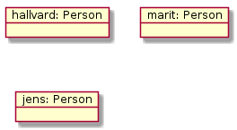
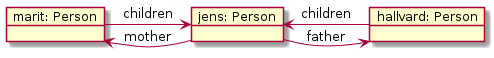
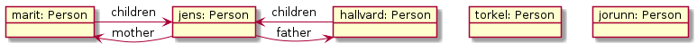
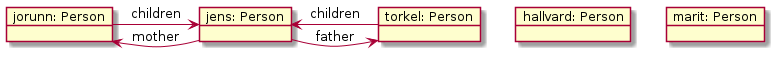

# Objektstrukturer - Person-oppgave

Denne oppgaven handler om en `Person`-klasse med en [1-n-assosiasjon](https://www.ntnu.no/wiki/display/tdt4100/Koding+av+1-n-assosiasjoner)
med rollene *children* og *mother*/*father* til samme klasse (altså barn-mor/far-forhold) og det å sikre konsistens, slik at foreldre og barn
er korrekt knyttet sammen.

En viktig del av det å implementere assosiasjoner er å sikre konsistens, dvs. at objekter i hver ende av en kobling refererer korrekt
til hverandre. Et eksempel på dette for [1-n-assosiasjoner](https://www.ntnu.no/wiki/display/tdt4100/Koding+av+1-n-assosiasjoner) er
foreldreskap, hvor foreldre og barn er koblet til samme i et slektstre. I denne oppgaven skal en `Person`-klasse implementeres og det å
legge til (og fjerne) barn håndteres korrekt, som illustrert nedenfor.

`Person`-klassen skal inneholde informasjon om *navn* (en String) og *kjønn* (en char, 'F' eller 'M'), som bare skal kunne settes i
konstruktøren, og *mor*, *far* og *barn*, som er andre Person-objekter. Navnet er ikke viktig for oppførselen, men er grei å ha med
i en `toString()`-metode, for å skille Person-objektene fra hverandre. `Person`-klassen skal ha følgende metoder for å lese tilstanden:

* `getName()` - returnerer navnet knyttet til dette Person-objektet
* `getGender()` - returnerer tegnet som representerer kjønnet, enten 'F' eller 'M'
* `getMother()` - returnerer Person-objektet som er moren, evt. `null`
* `getFather()` - returnerer Person-objektet som er faren, evt. `null`
* `getChildCount()` - returnerer antall barn dette Person-objektet har
* `getChild(int n)` - returnerer barn nr. n (altså et Person-objekt), evt. utløser (et passende) unntak om `n` er for stor (eller liten)

`Person`-klassen har to sett med endringsmetoder, knyttet til de to rollene i hver ende av *children*-*mother*/*father*-assosiasjonen.

Fra *children*-perspektivet har vi følgende to metoder:

* `addChild(Person)` - oppretter en kobling til et barn (et annet Person-objekt). Dersom Person-objektet som metoden kalles på, er
en *kvinne*, så skal denne bli barnets *mor*, og motsatt, dersom Person-objektet som metoden kalles på, er en *mann*, så skal denne
bli barnets *far*.
* `removeChild(Person)` - fjerner en kobling til et barn (et annet Person-objekt). Dersom Person-objektet som metoden kalles på, er *moren*
til argumentet, så skal *mother*-koblingen fjernes, og motsatt, dersom Person-objektet som metoden kalles på, er argumentets *far*, så skal
*father*-koblingen fjernes.

Fra *mother*/*father*-perspektivet har vi følgende to metoder:

* `setMother(Person)` - setter argumentet (en kvinne) som *moren* til Person-objektet som metoden kalles på. Argumentet får samtidig
registrert Person-objektet som metoden kalles på, som sitt *barn*.
* `setFather(Person)` - setter argumentet (en mann) som *faren* til Person-objektet som metoden kalles på. Argumentet får samtidig
registrert Person-objektet som metoden kalles på, som sitt *barn*.

Det som er verd å merke seg er at begge sett med metoder, `addChild`/`removeChild` og `setMother`/`setFather`, må ha logikk
som håndterer koblingen den andre veien, så `addChild`/`removeChild` må kalle `setMother`/`setFather` og omvendt, eller ha kode
med tilsvarende effekt. Dette kan være nokså fiklete, fordi en både må sikre konsistens og unngå uendelig nøstede kall
(inntil du får StackOverflowException).

Listen og figurene under illustrerer de fem tilfellene som må kunne håndteres, og som testes av testene det er lenket til.

### 1. Opprettelse av koblinger med `addChild`

**Kall**:
marit.addChild(jens)

hallvard.addChild(jens)

(Dette har samme effekt som kallene under punkt 2.)

**Før kall**:

**Etter kall**:

### 2. Opprettelse av koblinger med `setMother` og `setFather`

**Kall**:
jens.setMother(marit)

jens.setFather(hallvard)

(Dette har samme effekt som kallene under punkt 1.)

**Før kall**:

**Etter kall**:

### 3. Fjerning av koblinger med `removeChild`

**Kall**:
marit.removeChild(jens)

hallvard.removeChild(jens)

(Dette har samme effekt som kallene under punkt 4.)

**Før kall**:

**Etter kall**:

### 4. Fjerning av koblinger med `setMother` og `setFather`

**Kall**:
jens.setMother(null)

jens.setFather(null)

(Dette har samme effekt som kallene under punkt 3.)

**Før kall**:

**Etter kall**:

### 5. Fjerning og oppretting av kobling med `setMother` og `setFather`, en slags "adoption"

**Kall**:
jens.setFather(torkel)

jens.setMother(jorunn)

**Før kall**:

**Etter kall**:

## Oppgaven

Oppgaven er delt i to trinn, den første håndterer *children*- og *mother*/*father*-rollen isolert og uten krav om konsistens,
mens det andre skal sikre konsistens.

### Del 1
* Implementer `addChild`- og `removeChild`-metodene slik at `getChildCount`- og `getChild`-metodene virker som forventet.
Disse metodene håndterer altså kun *children*-rollen.
* Implementer `setMother`- og `setFather`-metodene slik at `getMother`- og `getFather`-metodene virker som forventet.
Disse metodene håndteres altså kun *mother*/*father*-rollen.

Test metodene ved å koble opp Person-objekter tilsvarende din egen familie. Du blir nødt til å bruke de tre metodene `addChild`, `setMother`
og `setFather`. Prøv å få med minst tre generasjoner.

### Del 2
Utvid metodene til å sikre konsistens. Test at det fortsatt virker å koble opp din egen familie, denne gangen ved å bare bruke
`addChild` og ved å bare bruke `setMother` og `setFather`. Kjør JUnit-testene som hører til oppgaven.

Testkode for denne oppgaven finner du her: [objectstructures/PersonTest.java](../../tests/objectstructures/PersonTest.java). Originalkoden (jextest) for testen finner du her: [objectstructures/Person.jextest](../../tests/objectstructures/Person.jextest).

### Exercise-panelet
Bruk av Exercise-panelet er obligatorisk for denne oppgaven. Du må ha panelet åpent med `Person.ex`-filen
(`tests > objectstructures > Person.ex`) i før du begynner med oppgaven. For mer informasjon/hjelp, se nederst på hovedsiden for Øving 5.
